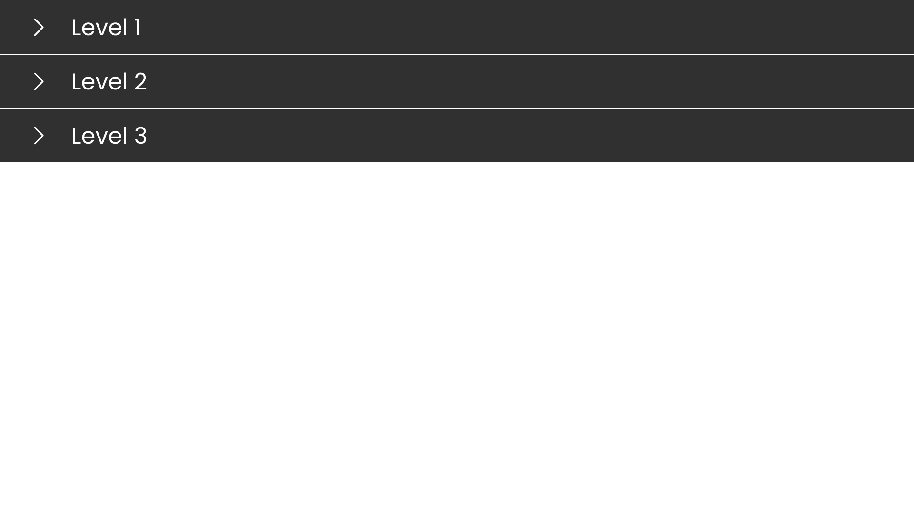
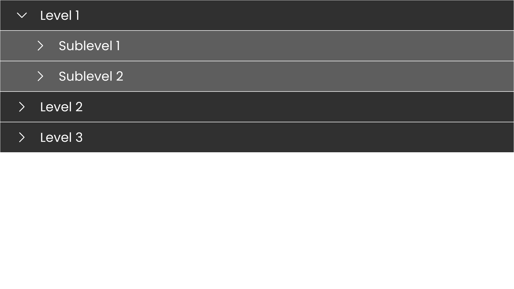
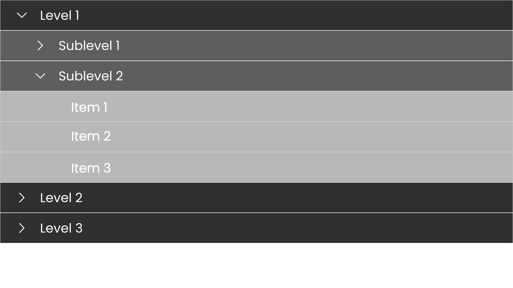

# Frontend Assignment: Hierarchical Structure Implementation

## Overview
This assignment involves implementing a hierarchical structure in a frontend application. You have the flexibility to choose colors, fonts, and design variations as long as the hierarchy remains clearly depicted.

## Hierarchy Structure
The hierarchy should follow the structure below:

```
- Level 1
  -- Sublevel 1
    --- Item 1
    --- Item 2
  -- Sublevel 2
    --- Item 1
    --- Item 2
    --- Item 3
- Level 2
  -- Sublevel 1
    --- Item 1
    --- Item 2
    --- Item 3
    --- Item 4
- Level 3
  -- Sublevel 1
    --- Item 1
  -- Sublevel 2
    --- Item 1
  -- Sublevel 3
    --- Item 1
    --- Item 2
    --- Item 3
  -- Sublevel 4
    -- Item 1
    -- Item 2
```

## Requirements
- Choose **colors** and **fonts** based on your preference.
- Ensure the hierarchy is **clearly visible** and **easy to understand**.
- You may explore different **design layouts**, as long as the structure remains intact.

## Suggested Features (Optional)
- **Collapsible Sections**: Use JavaScript to allow expanding/collapsing different levels.
- **Hover Effects**: Highlight items when hovered over.
- **Icons/Indicators**: Use icons to represent expandable/collapsible elements.
- **Responsive Design**: Ensure the structure is visible on different screen sizes.

## Example Screenshot





